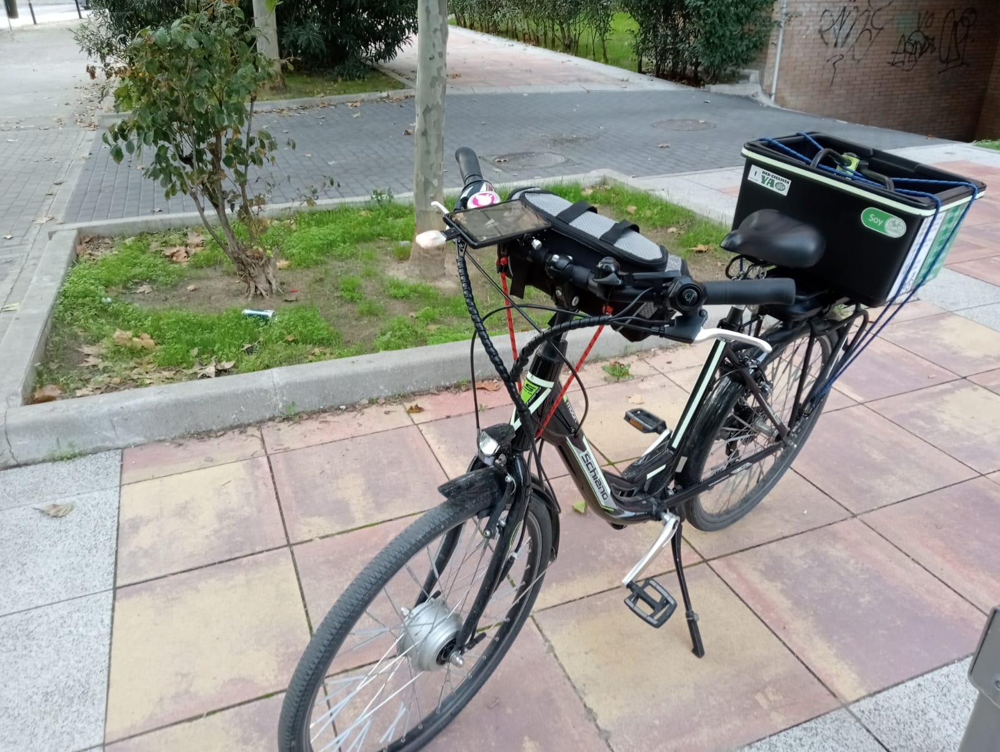
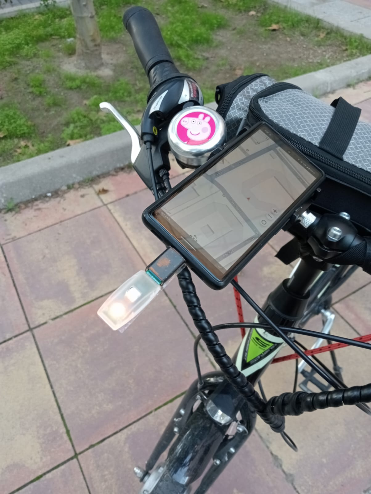

# CO2 Measurements in the streets of Madrid (Project "Bicinose")

The city of Madrid is well known for the beauty of its downtown, full of history and a great atmosphere where everyone can have fun at everytime and everywhere. 
Madrid never sleeps and many people are commuting or simply moving from one place to another.
Unfortunately, the city is at the tail end in terms of air quality, having exceed multiple times the limits for a healthy air quality.
https://www.ecologistasenaccion.org/319509/toda-la-poblacion-de-madrid-respiro-aire-contaminado-por-encima-de-los-nuevos-limites-legales/

Despite of a great public transportation with one of the biggest underground infrastructure in the world. The politics and decisions taken by the local governments have put the cars into the main focus of the mobility.   
https://www.eldiario.es/madrid/somos/madrid-dedica-coches-61-espacio-disponible-calles_1_11419048.html

The idea of this project is to have fun, ride our bikes and know the status of the air quality in the city of Madrid by using a SCD4x CO2 sensor.
https://sensirion.com/products/catalog/SCD4x-CO2-Gadget

